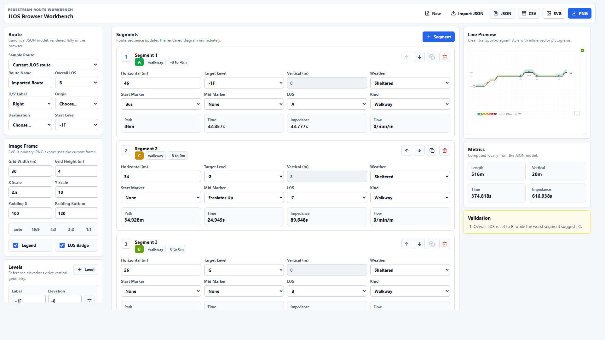

# JLOS Browser Workbench

Live site: https://jlos-browser-workbench.vercel.app

JLOS Browser Workbench is a browser-only route editor and diagram generator for pedestrian level-of-service studies. It converts the original Python/Processing-backed JLOS workflow into a deployable web app with client-side route editing, validation, SVG rendering, and PNG export.

The generated diagrams use a cleaner contemporary transport-diagram style: muted gridlines, accessible LOS color tokens, rounded route geometry, inline vector pictograms, and presentation-ready SVG/PNG output. Existing JLOS JSON samples remain supported, and legacy CSV export is available for compatibility.

## Screenshots




## Features

- Edit route metadata, terminals, levels, and segment geometry in the browser
- Load bundled sample JLOS routes
- Import and export canonical route JSON
- Export legacy-compatible CSV
- Generate modern SVG diagrams without a backend renderer
- Export high-resolution PNG diagrams from the browser
- Validate route structure and renderer readiness live

## Local Development

```bash
npm install
npm run dev
```

## Tests

```bash
npm run test
```

## Build

```bash
npm run build
```
